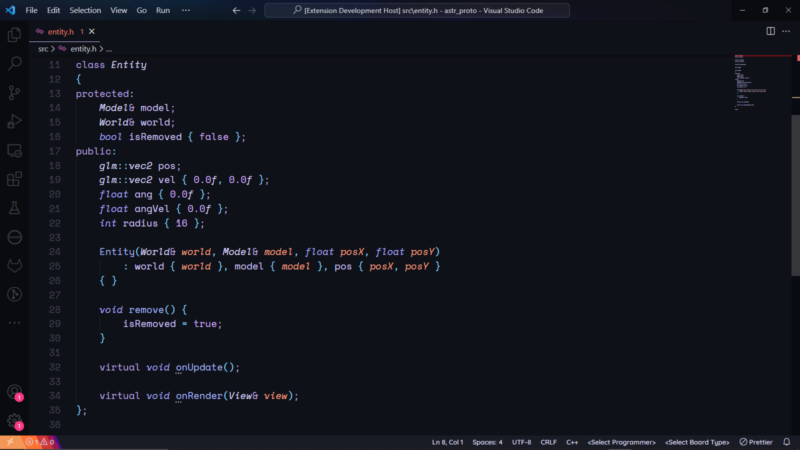
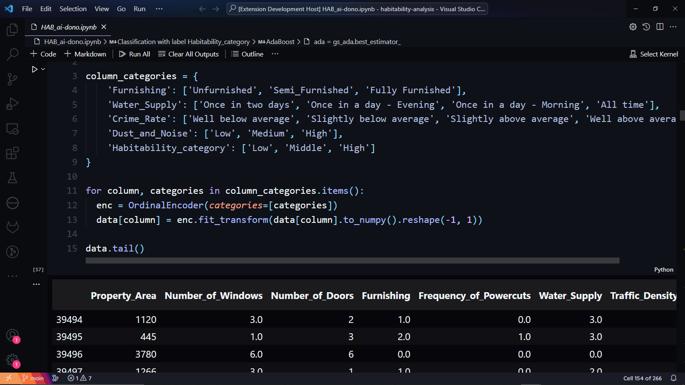
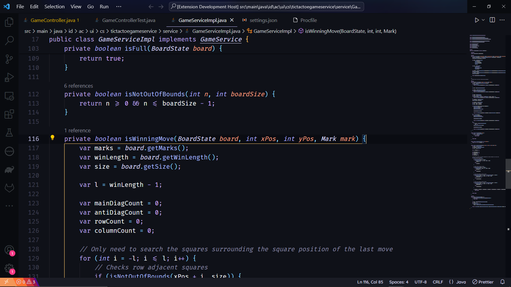
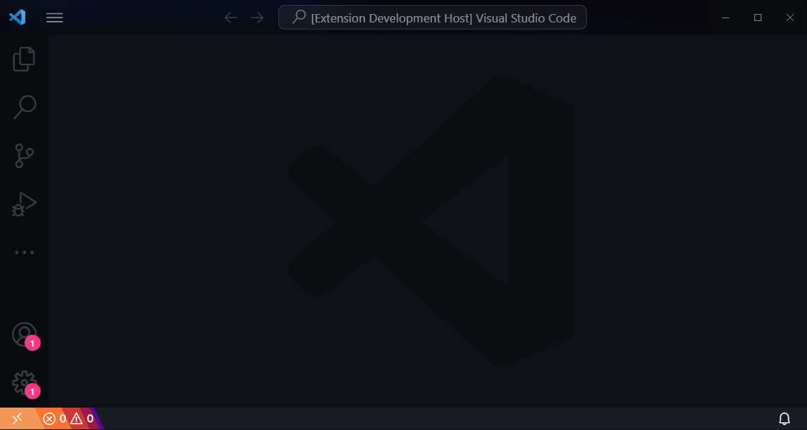
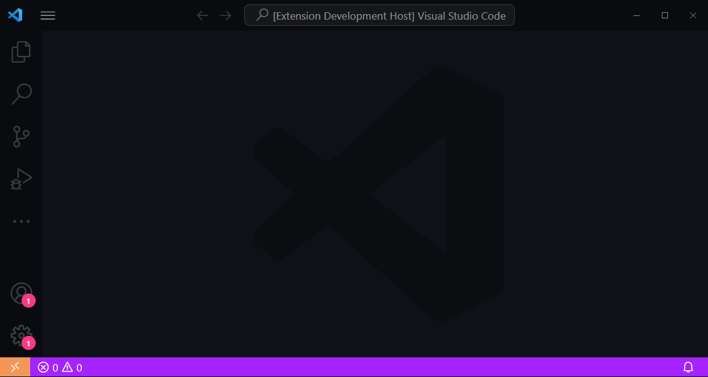

# Nightlife

*Nightlife* is a dark, subdued, medium-contrast color theme with a primarily dark blue palette for Visual Studio Code. It is built from the ground up to echo the hues of rain-soaked neon-lit cityscapes. Nightlife also introduces custom CSS to Visual Studio Code to give the whole workspace a more dynamic and retro-futuristic look.

## Installation

1. Open your Visual Studio Code.
2. Go to the **Extensions** tab in the activity bar.
3. Find the **Nightlife** extension.
4. Click **Install**.
5. Once installed, Visual Studio Code will present you with the option to use the normal color theme or the color theme without *italics*.

## Enabling and disabling the customizations

Nightlife with customizations enabled

Nightlife with customizations disabled

### Disclaimer

Enabling these customizations requires the extension to modify a core file inside your Visual Studio Code install directory. Please do so at your discretion.

Visual Studio Code will also notify you that your Visual Studio Code installation is corrupt after enabling the customizations as a core file is modified. You may dismiss this notification.

These customizations work by modifying the `workbench.html` file and injecting Nightlife's custom CSS into it. The extension always saves this file's backup `workbench.html.nightlifebak` before modifying it. As long as you do not delete this backup file, you can permanently disable these customizations again at any point.

Suppose the backup file goes missing while the customizations are still enabled, and you can not disable the customizations. In that case, you can reinstall Visual Studio Code or wait for an update.

### Enabling the customizations

1. Open the command palette. You can use the shortcut `Ctrl + Shift + P` in Windows or `Shift + ⌘ + P` in Mac.
2. Find and click "Nightlife: Enable Customizations (RELOADS VSCODE)." This command will reload your Visual Studio Code, so please save all your work first.

### Disabling the customizations

1. Open the command palette.
2. Find and click "Nightlife: Disable Customizations (RELOADS VSCODE)." This command will also reload your Visual Studio Code, so please save all your work first.

## Overriding Nightlife

You can follow this [guide](https://code.visualstudio.com/api/extension-guides/color-theme) if you wish to modify some aspects of this color theme yourself.

## Contributing

If you want to suggest ideas for improving Nightlife or wish to report a bug, please open an issue or a pull request in the GitHub repository. Any contributions are welcome, especially those that can improve the accessibility of this color theme.
